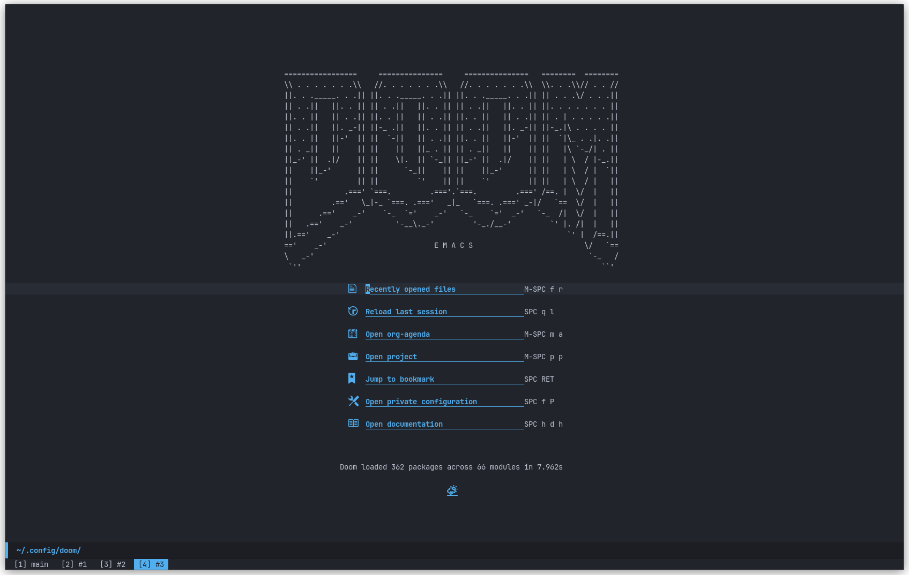
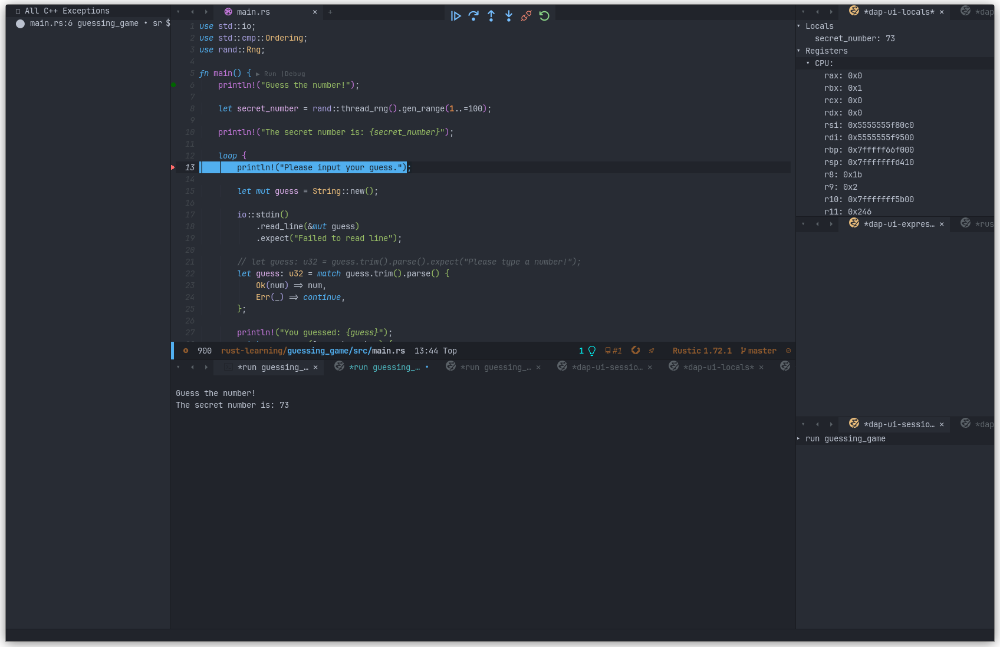

# Doom Emacs Config

## Images





## Literate Config
Found in: [config.org](./config.org)

## Pre-requisites

- **Fonts**

You can download the JetBrains font here: [JetBrains Mono Font](https://www.jetbrains.com/lp/mono/)

Install the Ubuntu fonts from here: [Ubuntu Fonts](https://design.ubuntu.com/font)
> [!NOTE]
> The variable pitch font for `org-mode` files use Cantarall font. Should be installed by default on distros like Ubuntu and Pop!_OS. If not, please download and install this font as well.

- **Install essential build tools**

``` bash
sudo apt install build-essential
```

- **Install `cmake`**

Needed to compile vterm

``` bash
sudo apt install cmake
```

- **Install pip**

``` bash
sudo apt install python3-pip
```

- **Install Pyright LSP Server**

``` bash
pip install pyright
```

- **Install CCLS LSP Server**

``` bash
sudo apt install ccls
```

- **Install Rust and `rust-analyzer`**

Install rust by following the official website: [Install Rust](https://www.rust-lang.org/tools/install)

And now install `rust-analyzer`

``` bash
rustup componet add rust-analyzer
```

If you want to update components added from `rustup`, run:

``` bash
rustup update
```

- **Install `texlab` LSP Server**

Installation instructions: [texlab GitHub](https://github.com/latex-lsp/texlab)

- **OPTIONAL: Install `texlive`**

If you want to use LaTeX with Emacs

``` bash
sudo apt install texlive-full
```

- **Install GDB**

`gdb` is used for Rust and C/C++ debugging.

``` bash
sudo apt install gdb
```

- **Install `gnome-screenshot`**

This is needed for `org-download-clipboard` to work.

``` bash
sudo apt install gnome-screenshot
```

- **Install `graphviz`**

This is needed for `org-roam` to generate graph visualisations.

``` bash
sudo apt install graphviz
```

- **Install `ripgrep`**

``` bash
sudo apt install ripgrep
```

- **Install X11 Clipboard**

``` bash
sudo apt install xclip

```

**Other packages**

In-case issues happen:

- `libtool-bin` is needed to compile `vterm`

- `wl-clipboard` on wayland

- `aspell`

- `fd`

<!-- ``` bash -->
<!-- sudo apt install libtool -->
<!-- sudo apt install libtool-bin -->
<!-- ``` -->

<!-- libtool-bin -->

- **Install `imagemagick`**

``` bash
sudo apt install imagemagick
```

- **Install `dvipng` and `dvisvgm`**

Just incase it is not installed by default in your distro.

```bash
sudo apt install dvipng
sudo apt install dvisvgm
```

## Installation

1. First install Emacs. Latest version is recommended. On Ubuntu 22.04 LTS based Linux distributions, you can use snap to install latest version.
2. Install Doom Emacs:

``` bash
git clone --depth 1 https://github.com/doomemacs/doomemacs ~/.config/emacs
~/.config/emacs/bin/doom install
```
More details about Doom Emacs can be found in the GitHub page: [Doom Emacs GitHub](https://github.com/doomemacs/doomemacs)

Run `doom sync` after installing Doom Emacs.

3. Download the repo and copy the contents of this repo to the directory: `~/.config/doom`
4. Run `doom sync` command after copying the contents.
5. Create a folder `+STORE` in your home directory
6. Add `export PATH="$HOME/.config/emacs/bin/:$PATH"` to your `~/.zshrc` or `~/.bashrc`

## Post Install

- In Emacs, run:
  - `M-x all-the-icons-install-fonts`
  - `M-x nerd-icons-install-fonts`
- If you have issues with not being able to preview inline LaTeX, such as equations, edit this file: `/etc/ImageMagick-6/policy.xml`
  - Change the line `<policy domain="coder" rights="none" pattern="PDF" />` to: `<policy domain="coder" rights="read|write" pattern="PDF" />`
- On Pop!_OS `libstdc++-12-dev` is not installed by default:
```bash
sudo apt install libstdc++-12-dev
```
- On KDE, comment out the Wayland Integration section in `config.org` to fix clibboard issues.
- `M-x treesit-install-language-grammar`
- `M-x customize-group` and change elcord to use `ts-mode` to have the correct Discord rich presence icon.
## TODO
- Update README Images
- GitHub Copilot
